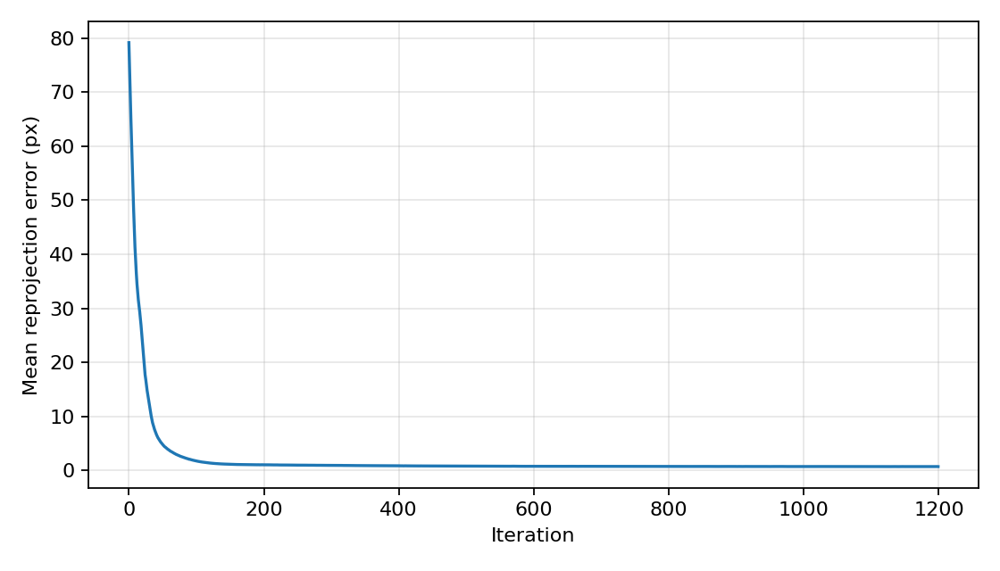
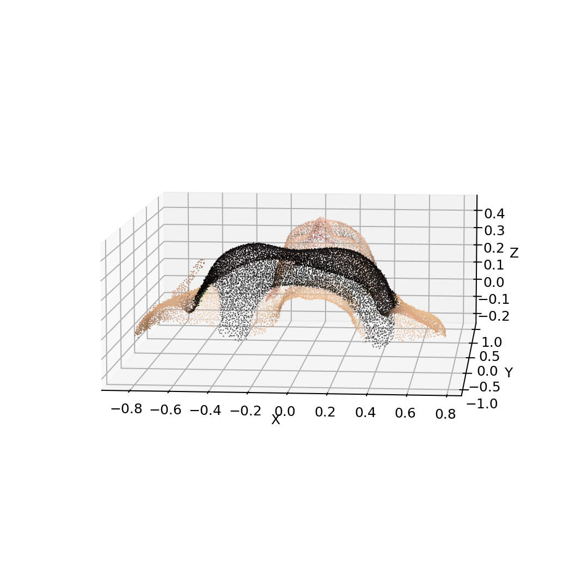

# Assignment 3 Report - Bundle Adjustment

## Task 1: PyTorch Bundle Adjustment

I implemented bundle adjustment from scratch in `ba_pytorch.py`. The optimizer estimates:

- shared focal length `f`
- per-view Euler rotation and translation
- all 20000 reconstructed 3D points

The projection model follows the assignment convention:

```text
[Xc, Yc, Zc] = R @ P + T
u = -f * Xc / Zc + cx
v =  f * Yc / Zc + cy
```

Because the global scale and coordinate frame of bundle adjustment are ambiguous, the implementation uses a mild point-centering regularizer and an initialization with cameras sweeping over the given frontal +/-70 degree range.

### Run

```bash
python ba_pytorch.py --device cuda --iters 1200 --batch-size 131072 --output-dir outputs/ba
```

CPU also works, but CUDA is much faster:

```bash
python ba_pytorch.py --device cpu --iters 3000 --batch-size 32768 --output-dir outputs/ba_cpu
```

### Result

The CUDA run used 805089 visible 2D observations.

| Metric | Value |
|---|---:|
| Optimized focal length | 882.77 px |
| Mean reprojection error | 0.724 px |
| Median reprojection error | 0.596 px |
| 90th percentile error | 1.387 px |

Loss curve:



Reconstructed colored point cloud preview:



Generated files:

- `outputs/ba/reconstruction.obj`
- `outputs/ba/ba_parameters.npz`
- `outputs/ba/loss_curve.png`
- `outputs/ba/point_cloud_preview.png`
- `outputs/ba/summary.json`

## Task 2: COLMAP Reconstruction

The full COLMAP command-line pipeline is provided in `run_colmap.sh`:

```bash
bash run_colmap.sh
```

It performs feature extraction, exhaustive matching, sparse reconstruction, undistortion, PatchMatch stereo, and stereo fusion. On this machine, `colmap` is not installed in `PATH`, so I could not generate the COLMAP sparse/dense output locally. After installing COLMAP, the script will write:

- sparse model: `data/colmap/sparse/0/`
- dense point cloud: `data/colmap/dense/fused.ply`
